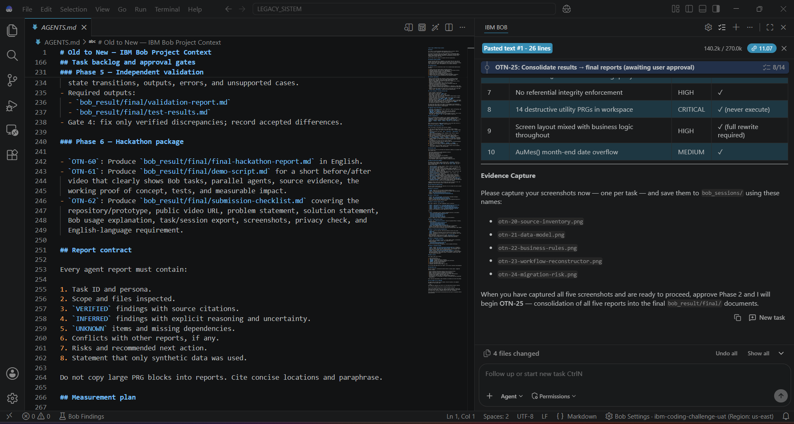
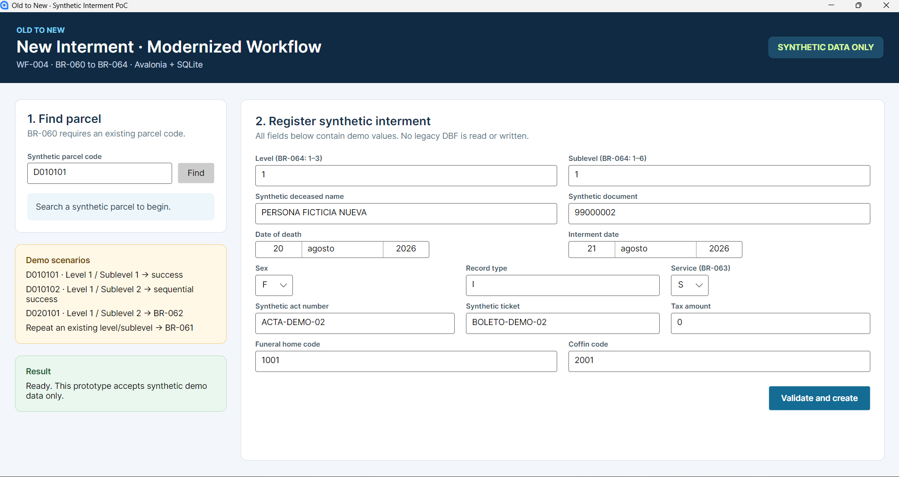

# Old to New — Evidence-Based Legacy Modernization with IBM Bob

Old to New is an IBM TechXchange 2026 Hackathon proof of concept that shows how
IBM Bob can safely turn an undocumented Clipper/xBase application into
traceable modernization work.

The project does **not** claim to migrate the complete legacy application. It
uses Bob to reconstruct verified behavior and then modernizes exactly one
user-approved workflow as an offline .NET, Avalonia, and SQLite vertical slice.



## The Problem

Critical behavior in the legacy application is embedded in large PRG files,
screen-coordinate code, global state, dynamic DBF aliases, and implicit index
relationships. The sanitized snapshot contains 25 PRG files and 22 DBF schemas,
but it lacks a complete Clipper runtime and several dynamically referenced
tables. Understanding the system manually is slow and risky: a developer must
separate active behavior from historical utilities, locate hidden writes, and
avoid promoting assumptions into requirements.

## The Solution

IBM Bob acts as an evidence and orchestration layer:

1. Read the persistent project contract and create bounded tasks.
2. Perform a privacy and safety review before functional analysis.
3. Coordinate five specialized read-only analyses in parallel.
4. Classify findings as `VERIFIED`, `INFERRED`, or `UNKNOWN`.
5. Consolidate source inventory, data model, business rules, workflows, and
   migration risks with narrow source citations.
6. Require user approval before a verified rule can become a modernization
   requirement.

The approved proof of concept modernizes **WF-004 New Inhumation** with only
BR-060 through BR-064. The implementation separates UI, application, domain,
and persistence concerns and validates the selected behavior with automated
tests and an independent read-only comparison.

## What IBM Bob Did

| Task | IBM Bob contribution | Evidence |
|---|---|---|
| OTN-00/01 | Project contract, task structure, and reusable personas | `bob_sessions/otn-01-project-initialization.png` |
| OTN-10 | Privacy and security gate | `bob_sessions/otn-10-security-review.png` |
| OTN-20 | PRG source and dependency inventory | `bob_result/agents/01-source-inventory.md` |
| OTN-21 | DBF schema and relationship reconstruction | `bob_result/agents/02-data-model.md` |
| OTN-22 | Business-rule extraction | `bob_result/agents/03-business-rules.md` |
| OTN-23 | End-to-end workflow reconstruction | `bob_result/agents/04-workflows.md` |
| OTN-24 | Maintainability and migration-risk analysis | `bob_result/agents/05-migration-risks.md` |
| OTN-25 | Consolidation and cross-report conflict review | `bob_result/final/analysis-summary.md` |

The official 40-Bobcoin allocation was exhausted during the final OTN-25
consistency pass. One terminology-only correction and all architecture,
implementation, testing, independent validation, and submission preparation
after that point are explicitly recorded as **manual post-budget work outside
IBM Bob**. IBM watsonx services were not used.

See [manual post-budget provenance](bob_result/logs/manual-phase3-provenance.md)
for the complete attribution boundary.

## Modernized Workflow

The selected flow implements five source-backed rules:

| Rule | Approved behavior |
|---|---|
| BR-060 | The parcel must exist. |
| BR-061 | Parcel, level, and sublevel must not already exist. |
| BR-062 | Every earlier sublevel for the same parcel and level must exist. |
| BR-063 | Service type must be `S` or `T`. |
| BR-064 | Level must be 1–3 and sublevel must be 1–6. |

BR-065 and every other legacy workflow are explicitly out of scope.



## Architecture

```text
Avalonia View → ViewModel → Application Use Case → Domain Rules
                                             ↓
                                  SQLite Persistence
```

- .NET 10 and Avalonia 12.1.1 desktop UI.
- SQLite with foreign keys, typed checks, a composite uniqueness constraint,
  and transactional writes.
- Deterministic synthetic fixtures.
- No production or network runtime connection.
- No runtime access to the root PRG or DBF evidence.

Architecture details and diagrams:

- [Target architecture](bob_result/final/target-architecture.md)
- [Migration plan](bob_result/final/migration-plan.md)
- [Target architecture diagram](bob_result/diagrams/target-architecture.md)
- [Legacy flow diagram](bob_result/diagrams/legacy-flow.md)

## Verified Results

| Metric | Result |
|---|---:|
| Legacy PRG files inventoried | 25 |
| DBF schemas documented | 22 |
| Synthetic legacy records | 45 |
| Parallel specialized Bob analyses | 5 |
| Consolidated verified business rules | 46 |
| Rules approved for the PoC | 5 |
| Independently passing approved rules | 5/5 |
| Automated tests | 21/21 passed |
| Release build | 0 warnings, 0 errors |
| Verified implementation discrepancies | 0 |
| Gate-4-accepted target differences | 2 |

No manual-before-versus-assisted time baseline was recorded, so this project
does not claim a fabricated percentage or time saving.

## Build, Test, and Run

Prerequisite: .NET SDK 10.0.400 or a compatible .NET 10 SDK.

```powershell
cd modernized
dotnet restore OldToNew.sln
dotnet format OldToNew.sln --verify-no-changes --no-restore --verbosity minimal
dotnet build OldToNew.sln --no-restore --configuration Release
dotnet test OldToNew.sln --no-build --configuration Release
dotnet run --no-build --configuration Release --project src/OldToNew.Desktop/OldToNew.Desktop.csproj
```

Suggested synthetic demo scenarios are displayed in the application:

- `D010101`, level 1, sublevel 1 → successful creation.
- Repeat the same location → BR-061 duplicate rejection.
- `D020101`, level 1, sublevel 2 → BR-062 sequential rejection.

## Repository Guide

| Path | Contents |
|---|---|
| `AGENTS.md` | Authoritative project contract, safety rules, tasks, and gates |
| `.bob/agents/` | Reusable specialized IBM Bob personas |
| `bob_result/agents/` | IBM Bob specialist reports |
| `bob_result/final/` | Consolidated analysis, architecture, validation, and submission documents |
| `bob_result/diagrams/` | Legacy and target architecture diagrams |
| `bob_result/logs/` | Build, test, correction, and provenance records |
| `bob_sessions/` | IBM Bob task evidence and clearly labeled manual captures |
| `modernized/` | Runnable .NET/Avalonia/SQLite proof of concept and tests |
| Root `*.PRG` / `*.DBF` | Read-only sanitized legacy evidence |

## Submission Materials

- [Final hackathon report](bob_result/final/final-hackathon-report.md)
- [Three-minute demo script](bob_result/final/demo-script.md)
- [Submission form text](bob_result/final/submission-form-text.md)
- [Submission checklist](bob_result/final/submission-checklist.md)
- Demo video URL: **to be added after publication**

## Privacy, Safety, and Limitations

- All DBF records and generated fixtures are visibly synthetic.
- Original indexes were intentionally removed because they could retain source
  values; no NTX/CDX file is committed.
- Root PRG and DBF files are preserved as read-only evidence.
- Destructive legacy utilities are never executed.
- No production system, API, server, network share, or external database is
  contacted.
- Full legacy runtime parity remains `UNKNOWN` because the sanitized snapshot
  is incomplete.
- Only WF-004 and BR-060 through BR-064 are implemented and validated.

Only synthetic data was used in this repository.
