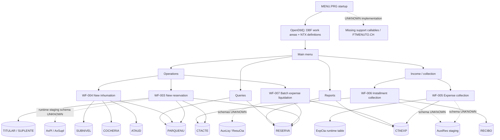

# Legacy Flow

**Task ID:** OTN-30  
**Role:** Manual modernization-architect role (non-Bob, post-budget)  
**Date:** 2026-08-29  
**Status:** COMPLETE  
**Labels:** Solid paths are `VERIFIED`; dashed dependencies contain `UNKNOWN` implementation details.

## Evidence

- **VERIFIED:** Startup and `OpenDbf()` are documented in `legacy-system-overview.md` §5–§6 (`MENU.PRG:1–15,3854–4092`).
- **VERIFIED:** Candidate workflows and their reads/writes are documented in `04-workflows.md`, WF-003 through WF-007.
- **VERIFIED:** Persistent relationships are documented in `data-model.md` §3.
- **UNKNOWN:** Runtime-only table schemas and missing callable implementations are not reconstructed here (`data-model.md` §2 and §5; `migration-risks.md` MR-030 and MR-033).

Only the sanitized reports and synthetic-data context were used. No legacy file was executed or modified.

