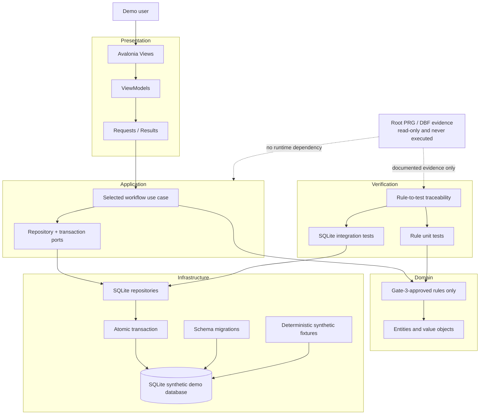

# Target Architecture Diagram

**Task ID:** OTN-30  
**Role:** Manual modernization-architect role (non-Bob, post-budget)  
**Date:** 2026-08-29  
**Status:** COMPLETE — implementation awaits Gate 3

## Architecture Statements

- **TARGET DECISION:** Avalonia owns interaction only; business rules remain in the domain/application layers.
- **TARGET DECISION:** SQLite foreign keys, unique indexes, and transactions replace application-only integrity and non-atomic writes identified in MR-054/MR-055.
- **TARGET DECISION:** Tests reference approved rule IDs and do not derive new behavior from convention.
- **VERIFIED constraint:** Root PRG and DBF files remain read-only evidence and are not runtime inputs.
- **UNKNOWN:** Production deployment, identity, concurrency scale, and data-migration requirements remain outside this PoC.

Only synthetic fixtures are permitted in the target database and screenshots.

